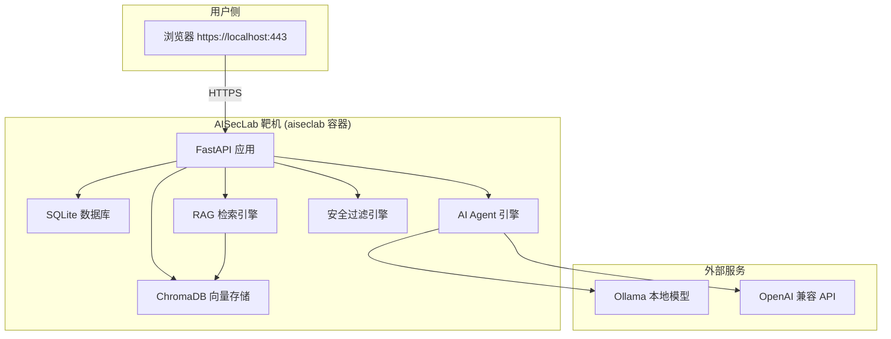
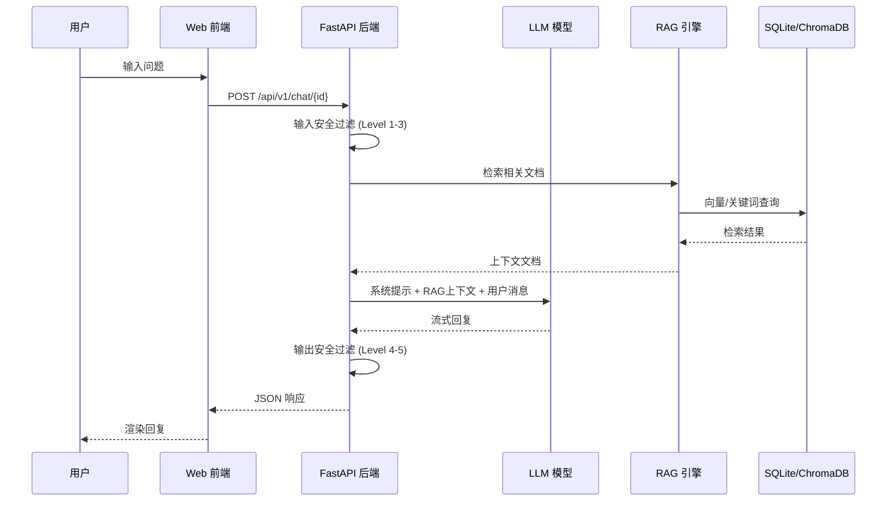

# AISecLab 系统架构



## 核心模块

### 1. 对话管理
- 会话创建 / 恢复
- 多轮对话上下文维护
- RAG 检索增强问答
- LLM 工具调用 (Tool Calling)

### 2. 安全过滤
- 5 级 AI 安全防线 (Level 1-5)
- 输入关键词/语义检测
- 输出内容审核
- 越狱检测（关键词 → 意图 → 角色扮演）

### 3. 实验模块系统
- 16 个安全实验模块
- 任务评分与进度追踪
- Flag 捕获机制
- 攻击链复盘

### 4. 工单系统
- 工单创建 / 升级 / SLA 管理
- AI Agent 自动决策 (关闭 / 升级 / 折扣)
- 对话摘要生成

### 5. 数据库层
- 11 张表：users, sessions, conversations, messages, products, support_tickets, ticket_updates, ticket_categories, knowledge_base, document_chunks, user_preferences, audit_events
- SQLite + WAL 模式
- ChromaDB 向量索引

## 部署架构

```
Docker Compose
├── aiseclab 容器
│   ├── Python 3.11-slim-bookworm
│   ├── Uvicorn HTTPS (port 443)
│   ├── 自签名 TLS 证书
│   └── 挂载卷: data/, knowledge_base/
└── (可选) Ollama 本地模型服务
```

## 3. 核心流程框架



## 安全特性

- Fernet 加密 Session
- PBKDF2-SHA256 / bcrypt 密码哈希
- 速率限制中间件
- CSP / HSTS / X-Frame-Options 安全头
- 管理 API Token 认证
