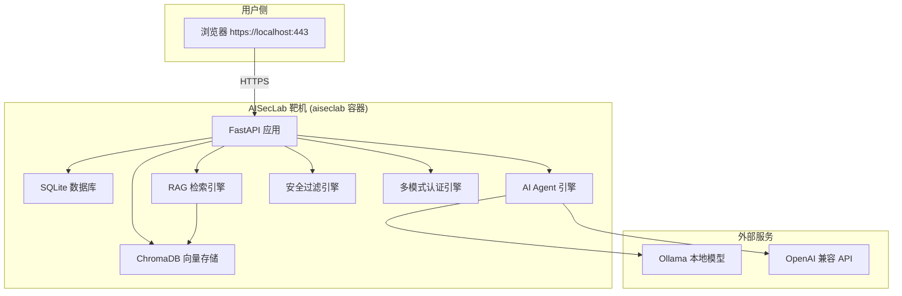
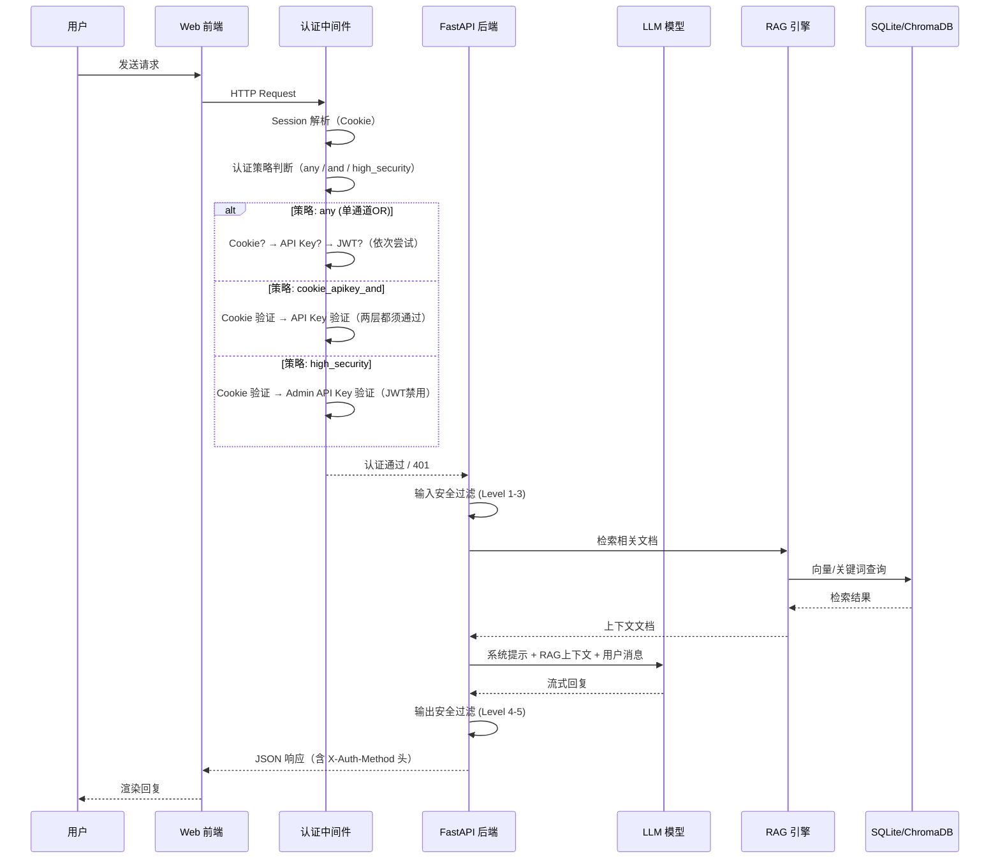

# AISecLab 系统架构



## 核心模块

### 1. 多模式认证引擎（v0.5.0 新增）

AISecLab 实现了 **3 种认证通道 + 3 种认证策略** 的组合架构：

#### 认证通道（可独立启停）

| 通道 | 配置开关 | 说明 |
|------|----------|------|
| Cookie Session | `LAB_AUTH_MODE_COOKIE` | Fernet 加密 Cookie，用户名+密码登录 |
| API Key | `LAB_AUTH_MODE_APIKEY` | 支持 x-api-key / Bearer / query 三种载体，含 name+role 绑定 |
| JWT Token | `LAB_AUTH_MODE_JWT` | HS256 签名，支持 token 签发/验证/debug 端点 |

#### 认证策略（运行时切换）

| 策略 | 逻辑 | 使用场景 |
|------|------|----------|
| `any`（默认） | Cookie **OR** API Key **OR** JWT | 单通道认证，覆盖 90% 真实场景 |
| `cookie_apikey_and` | Cookie **AND** API Key | 两层同时通过，模拟企业 AI 网关 |
| `high_security` | Cookie **AND** Admin API Key | JWT 禁用，模拟金融/军工级安全 |

**切换方式：**
- Web UI：观测台 `/ai/admin/lab` → 认证策略切换面板
- API：`POST /api/v1/auth/policy {"policy": "cookie_apikey_and"}`
- 环境变量：`LAB_AUTH_POLICY=any`（重启后生效）

认证流程详见 `knowledge_base/scenarios/auth_modes_guide.md`。

### 2. 对话管理
- 会话创建 / 恢复
- 多轮对话上下文维护
- RAG 检索增强问答
- LLM 工具调用 (Tool Calling)

### 3. 安全过滤
- 5 级 AI 安全防线 (Level 1-5)
- 输入关键词/语义检测
- 输出内容审核
- 越狱检测（关键词 → 意图 → 角色扮演）

### 4. 实验模块系统
- 16 个安全实验模块
- 任务评分与进度追踪
- Flag 捕获机制
- 攻击链复盘

### 5. 工单系统
- 工单创建 / 升级 / SLA 管理
- AI Agent 自动决策 (关闭 / 升级 / 折扣)
- 对话摘要生成

### 6. 数据库层
- 11 张表：users, sessions, conversations, messages, products, support_tickets, ticket_updates, ticket_categories, knowledge_base, document_chunks, user_preferences, audit_events
- SQLite + WAL 模式
- ChromaDB 向量索引

## 部署架构

```
Docker Compose
├── aiseclab 容器
│   ├── Python 3.11-slim-bookworm
│   ├── Uvicorn HTTPS (port 443)
│   ├── 自签名 TLS 证书
│   └── 挂载卷: data/, knowledge_base/
└── (可选) Ollama 本地模型服务
```

## 核心流程框架

### 请求处理流程



## 安全特性

- **多模式认证引擎**：Cookie / API Key / JWT 三通道，`any` / `cookie_apikey_and` / `high_security` 三策略，运行时可切换
- Fernet 加密 Session
- PBKDF2-SHA256 / bcrypt 密码哈希
- API Key 角色模型（admin / user / viewer），支持权限分级
- 速率限制中间件（客户端+路径粒度，1-120/min 可调）
- CSP / HSTS / X-Frame-Options / X-Content-Type-Options 安全响应头
- 管理 API Token 认证
- JWT Token 签发/验证/debug 端点（靶机训练用途）
